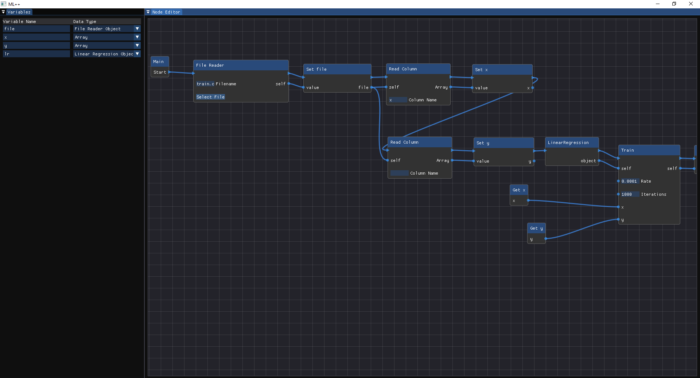
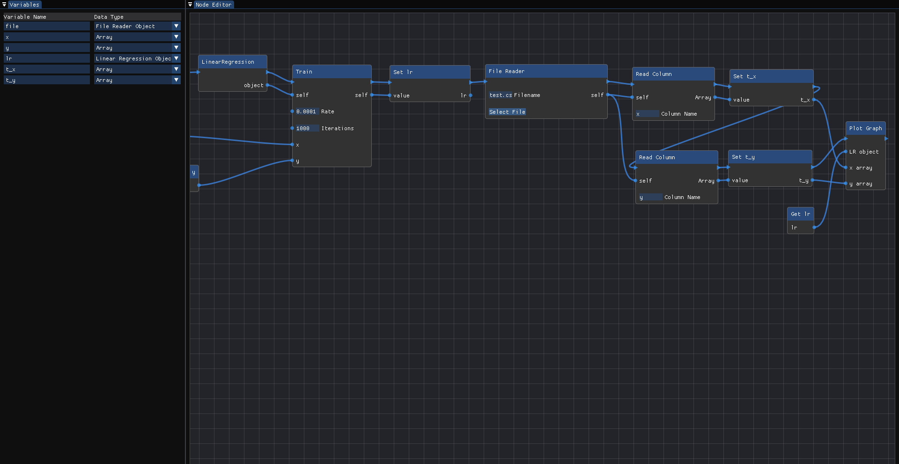
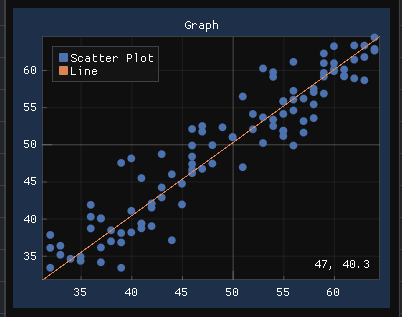

# MLPlusPlus

MLPlusPLus is a app where you can select a algorithm and train dataset, plot graphs, etc. MLPlusPlus provides a visual scripting language to write a script to train a machine learning model.

## Instructions
* To add new variable right click on variable panel and click add variable and type variable name and select datatype.
* To execute script simple press F5  

    
    
    

## Steps to compile

### Prerequisite
* Add [premake5][1] to path

### Windows
* Open command promt
* Clone project with `git clone --recurse-submodules https://github.com/vedpatil611/MLPLusPlus`
* `cd MLPlusPLus`
* `GenerateVisualStudioFiles.bat`
* Open MLPlusPLus.sln with Visual Studio 2019 and compile from there (default should be ctrl + b)

### Linux
* Open your terminal
* Clone project with `git clone --recurse-submodules https://github.com/vedpatil611/MLPLusPlus`
* `cd MLPlusPLus`
* `chmode +x GenerateMakefile.sh`
* `./GenerateMakefile.sh`
* `make`
* `sudo make install` (optional)

[1]: https://github.com/premake/premake-core
